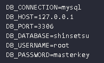

# Projeto-Integrador-Shinsetsu
Projeto destinado a disciplina - Projeto Integrador II da UPF

## Instalação do Node
Acesse o site o site e baixe o Node https://nodejs.org/en/download/

## Instalação do PHP
Baixe o Xampp/Wampp para o PHP ou instale diretamente do repositório do sistema operacional

- Após a instalação, verifique no terminal se o php foi instalado com sucesso com o comando 'php -v'

## Configuração do PHP
Acesse e abra o arquivo 'php.ini' (utilizando o xampp, o caminho é este C:\xampp\php)

a) Procure por "extension_dir" e descomente (retire o ";" - ponto e vírgula - no início da linha caso exista) a linha.

b) Procure por "display_errors" e deixe configurado com "On"

c) Procure por "display_startup_errors" e deixe configurado como "On"

d) Procure por "log_errors" e deixe configurado "On"

e) Procure por "error_log" e configure o caminho que deseja armazenar o arquivo de log de errors

f) Procure pelas seguintes extensões e descomente as linhas:
  - extension=curl
  - extension=intl
  - extension=mbstring
  - extension=mysqli
  - extension=openssl
  - extension=pdo_mysql
  - extension=pdo_sqlite

## Banco de Dados 
O projeto utiliza o banco Mysql, baixe o programa caso não tenha instalado na máquina. Após instalado e configurado, crie um database com o nome 'shinsetsu'. O nome para do database será configurado no arquivo .env nos próximos passos deste documento.

## Clonando o projeto
Clone o projeto do repositório GitHub
git clone https://github.com/daninunesdealmeida/Projeto-Integrador-Shinsetsu.git

- Para resolver problemas de comandos na execução do projeto, execute este comando no terminal: 
'composer install'

## Environment 
- Execute esse comando no terminal para gerar o arquivo onde serão configurados os dados importantes da aplicação 'cp .env.example .env'

- Após esse passo do arquivo .env, vamos gerar a chave da aplicação utilzando o comando 'php artisan key:generate'

Caso ocorra algum erro

Execute o comando no terminal 'composer update' e em seguida novamente o comando 'php artisan key:generate'

- Alterne no arquivo .env as configurações do banco de dados 

## Migrations e Seeds
- Execute no terminal o comando 'php artisan migrate' para a criação das tabelas no comando 
- Execute no terminal o comando 'php artisan db:seed' para inserir dados das tabelas no banco

## Execução do projeto
Por fim, execute o comando 'php artisan serve' para subir o projeto local e em seguida acesse no browser a url 'http://127.0.0.1:8000'

